## 1. Architecture Diagram (Mermaid)

```mermaid
flowchart LR
  %% =======================
  %% Data Sources
  %% =======================
  subgraph DS["Datasets (TRD GR Cup)"]
    T0["Telemetry CSVs\n(speed, gear, nmot, ath, aps,\npbrake_f/r, accx/accy,\nsteering_angle, GPS, lapdist,\nmeta_time, timestamp)"]
    L0["Lap/Timing Files\n(lap start/end, lap time,\nclassification if available)"]
    M0["Track Maps\n(Barber, COTA, Indy,\nRoad America, Sebring,\nSonoma, VIR)"]
  end

  %% =======================
  %% Ingestion & Normalization
  %% =======================
  subgraph IN["Ingestion & Normalization"]
    I1["Loader\n(per-track zip unpack)\nSchema unify"]
    I2["Time Rebase\nuse meta_time ordering\nECU timestamp optional"]
    I3["Lap Segmenter\nlapdist wraparound\nsector split"]
    I4["Smoother\nGPS Kalman / rolling mean\nsignal denoise"]
  end

  %% =======================
  %% Feature Engineering
  %% =======================
  subgraph FE["Feature Engineering"]
    F1["Per-lap Features\nlap time, sector deltas,\npace slope"]
    F2["Driver Inputs\nbrake/throttle curves,\nshift points, steering variance"]
    F3["Grip/Degradation Proxies\naccy drop, steering↑ for same speed,\nbrake drift, throttle variance"]
    F4["Opponent Alignment\nalign by lapdist/sector\nrelative gaps & closing rates"]
  end

  %% =======================
  %% Models / Analytics
  %% =======================
  subgraph ML["Models & Strategy Engines"]
    P1["Pace Forecaster\n(LightGBM/LSTM)\nnext 3–5 lap projection"]
    P2["Pit Window Optimizer\nhybrid rules + ML\nposition-after-pit sim"]
    P3["Undercut/Overcut Simulator\npace delta vs rivals\ntraffic penalty"]
    P4["Threat Detector\nclosing rate + sector advantage\nattack probability"]
    P5["Degradation Inference\nproxy curve + cause classifier"]
  end

  %% =======================
  %% Serving Layer
  %% =======================
  subgraph SV["Serving & Realtime"]
    S1["Inference API\nPython FastAPI/Cloud Function"]
    S2["Realtime Store\nFirestore/Redis\nrace_state, predictions"]
    S3["WebSocket Gateway\npush updates to UI"]
  end

  %% =======================
  %% Frontend
  %% =======================
  subgraph UI["Frontend (Next.js + shadcn/ui)"]
    U1["Strategy Dashboard\nPace, Pit Window,\nThreat Radar, Degradation,\nTrack Map"]
    U2["Controls Panel\nTrack/Session/Driver select,\nReplay speed, Lap scrub"]
  end

  %% =======================
  %% Flows
  %% =======================
  T0 --> I1
  L0 --> I1
  M0 --> I1
  I1 --> I2 --> I3 --> I4 --> FE
  FE --> P1
  FE --> P2
  FE --> P3
  FE --> P4
  FE --> P5

  P1 --> S1
  P2 --> S1
  P3 --> S1
  P4 --> S1
  P5 --> S1

  S1 --> S2 --> S3 --> U1
  U2 --> U1

  %% Optional offline training loop
  subgraph TR["Offline Training (optional in hackathon)"]
    TR1["Train per-track or global\ncross-validation"]
    TR2["Model Registry\nversioned artifacts"]
  end
  FE --> TR1 --> TR2 --> S1

```



---

## 2. ASCII Wireframes — RaceCraft Live Dashboard

### 2.1 Main “Race Engineer Live View”

```
+-----------------------------------------------------------------------------------+
| RaceCraft Live                                              Track: COTA  | Live ● |
| Session: Race 2   Driver: GR86-004-78   Lap: 12/20   P: 5   Gap F/B: +0.8 / -1.2  |
+--------------------------------------+--------------------------------------------+
| PIT WINDOW (Recommended)            | PACE FORECAST (Next 5 Laps)                 |
|-------------------------------------|--------------------------------------------|
| Best window: Laps 14–16 (82%)       |  Lap 13: 2:17.52  (+0.05)                  |
| If pit now (Lap 12): P8 (-3 spots)  |  Lap 14: 2:17.60  (+0.08)                  |
| If pit Lap 15: P5 (0 spots)         |  Lap 15: 2:17.74  (+0.14)                  |
| Undercut vs Car #22: +0.32s gain    |  Lap 16: 2:17.92  (+0.18)                  |
| Overcut risk (traffic): Medium      |  Lap 17: 2:18.10  (+0.22)                  |
+--------------------------------------+--------------------------------------------+
| THREAT RADAR                        | DEGRADATION CURVE (Proxy)                  |
|-------------------------------------|--------------------------------------------|
| Closest behind: Car #22 (0.6s)      |  Stint degradation: +0.20s/lap             |
| Attack prob next 2 laps: 71%        |  Cause: Lateral grip loss + brake drift    |
| Where they’re faster:               |                                            |
|  - T1 braking entry (+0.12s)        |  Lap 8  9  10  11  12  13  14 ...           |
|  - T9 exit throttle (+0.08s)        |  |----|----|----|----|----|----|           |
| Defensive mode suggestion: ON       |  ^ you are here                            |
+--------------------------------------+--------------------------------------------+
| TRACK MAP (Live Positions)                                                      |
|----------------------------------------------------------------------------------|
|   [Mini track outline w/ GPS]        Legend:  You=●  Ahead=▲  Behind=■  Traffic=□ |
|   Turn markers, sectors             Shows closing rate arrows                    |
|   Ideal line overlay (optional)                                               |
+----------------------------------------------------------------------------------+
| LAP/SECTOR DELTA HEATMAP                                                        |
|----------------------------------------------------------------------------------|
| Sector 1: +0.11s  | Sector 2: -0.05s  | Sector 3: +0.18s                          |
| Corners: T1 ▲ +0.07  T2 ■ -0.03  T3 ▲ +0.04  T9 ▲ +0.08  T12 ■ -0.02              |
+----------------------------------------------------------------------------------+

```

### 2.2 “Replay / Analysis Mode” (for judges demo)

```
+-----------------------------------------------------------------------------------+
| RaceCraft Live - Replay                                  Track: Sonoma  | Replay ▶ |
| Session: Race 1   Driver: GR86-006-11   Lap scrub: [====|-----]  Speed: 4x         |
+------------------------------+------------------------------+----------------------+
| TELEMETRY TIMELINE           | LAP TRACE COMPARISON         | STRATEGY EVENTS      |
|------------------------------|------------------------------|----------------------|
| Speed (km/h)                 | Current lap vs Best lap      | Lap 5: Pace drop     |
| Throttle (ath/aps)           |  - delta per lapdist         | Lap 7: Undercut      |
| Brake (pbrake_f/r)           |  - braking points overlay    | Lap 9: Attack risk   |
| Steering_Angle               |  - corner labels             | Lap 10: Pit window   |
| accx/accy G-forces           |                              |                      |
+------------------------------+------------------------------+----------------------+
| TRACK MAP + LINE OVERLAY                                                    |
|------------------------------------------------------------------------------|
| GPS trace for multiple laps, color by speed or throttle                      |
| Click corner → see micro insight: "Brake 6m later; throttle 0.2s earlier"    |
+------------------------------------------------------------------------------+

```

### 2.3 Mobile/Tablet “Pit Wall Quick View”

```
+----------------------------------------------------------+
| RaceCraft Live  | Lap 12 | P5 | Pit window: 14–16 (82%)  |
+-----------------+----------------------------------------+
| Pace next lap: 2:17.60 (+0.08)                           |
| Degradation: +0.20s/lap (Grip loss)                      |
| Threat: Car #22 attack prob 71%                          |
+----------------------------------------------------------+
| Action cards:                                             |
| [Defend T1]  [Push 2 laps then pit]  [Hold pace]          |
+----------------------------------------------------------+

```